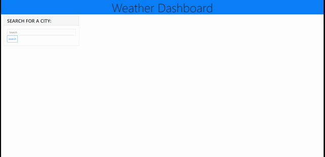

# weather-dashboard

## Description

This application generates the current weather and future 5-day forecast for a city so that travelers can  look ahead and plan accordingly.
Used mostly JavaScript and JQuery with a HTML base. Some minimal CSS was also used. 

## Installation

Follow provided link to application:
https://kimberlyseddon.github.io/weather-dashboard/ 

Enter your city in the space provided to receive current weather data and a forecast for the next few days. Previously searched cities are then saved for future ease. 

## Usage
Use this application to plan trips to other cities accordingly.

## Credits

Using information from an array of learning platforms and class room discussions along with TA input I was able to build this project. 